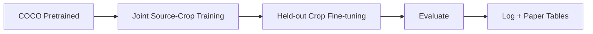
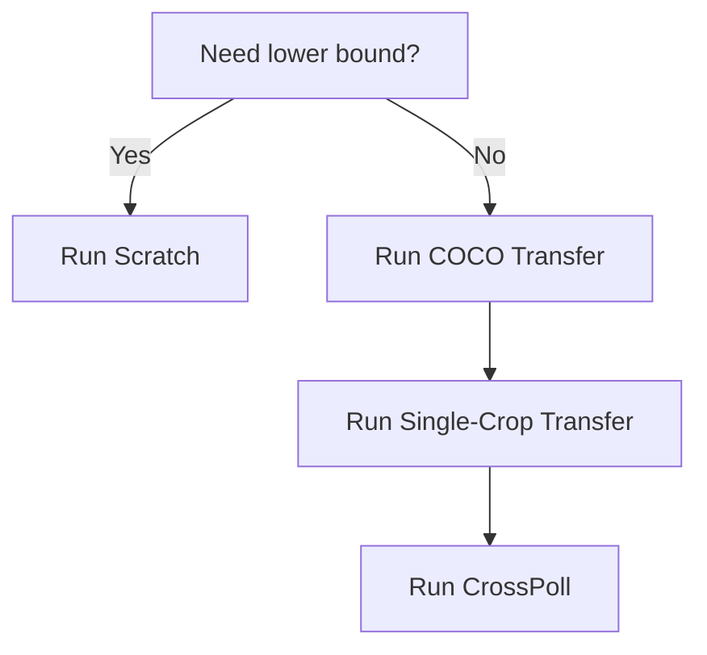

# CrossPoll Cheat Sheet

Use this page before every coding or writing session.

---

## 1) One-Glance Dashboard

| Block | Current standard |
|---|---|
| Model | `yolov8n.pt` |
| Strategy | COCO → Multi-crop pretrain → Held-out fine-tune |
| Label budgets | `25, 50, 100, 200, 500` |
| Primary metric | `mAP@50` |
| Repro logs | `experiments/registry.csv`, `results/summary.csv` |

---

## 2) Pipeline Flow

---

## 3) Metric Formula Box

$$
IoU = \frac{Area(Pred \cap GT)}{Area(Pred \cup GT)}
$$

$$
Precision = \frac{TP}{TP + FP}, \quad Recall = \frac{TP}{TP + FN}
$$

$$
F1 = 2 \cdot \frac{Precision \cdot Recall}{Precision + Recall}
$$

`mAP@50` = mean AP across classes at IoU threshold 0.50.

---

## 4) Baseline Decision Panel

Success signal:
- CrossPoll should beat COCO transfer especially at low-N.

---

## 5) Mini Practical Examples

| Situation | Bad pattern | Better pattern |
|---|---|---|
| Data split | Duplicate scene appears in train and test | Strict split + duplicate check |
| Low-label study | Different sample set each run without record | Fixed seed + fixed N protocol |
| Transfer setup | Full fine-tune immediately at N=25 | Freeze backbone first, then unfreeze |

---

## 6) Training Knob Guide

| Knob | If too low | If too high |
|---|---|---|
| `lr0` | Slow/no learning | Unstable or diverging training |
| `epochs` | Underfit | Overfit risk |
| `imgsz` | Miss small flowers | Slower training/inference |
| `batch` | Noisy updates | OOM risk |
| `patience` | Early stop too soon | Wasted epochs |

---

## 7) Fast Debug Matrix

| Symptom | Most likely cause | First fix |
|---|---|---|
| Val mAP near zero | Label format/class mismatch | Validate annotations and names |
| Train high, val low | Overfit | Increase augmentation / regularize |
| Run-to-run metric drift | Uncontrolled randomness | Lock seed and split version |
| Good run but unusable | Missing logs | Fill registry + results CSV immediately |

---

## 8) Session Exit Checklist (Non-Negotiable)

- [ ] Run recorded in `experiments/registry.csv`
- [ ] Final metrics appended to `results/summary.csv`
- [ ] Any protocol changes added to `ops/DECISIONS.md`
- [ ] Next step written in `ops/SESSION_HANDOFF.md`

If this checklist is incomplete, the experiment is not paper-ready.
