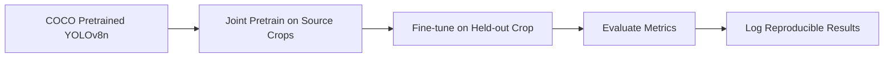
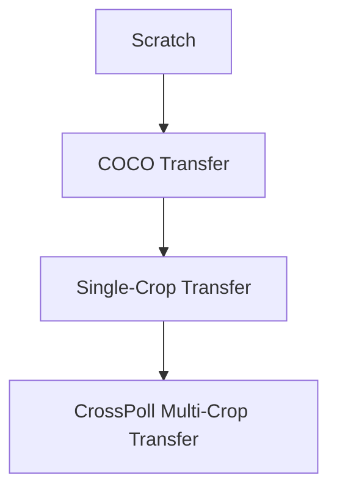
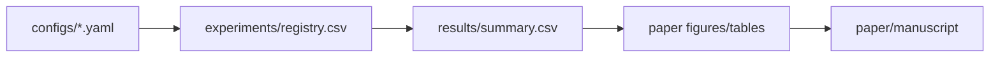

# Learning Guide for CrossPoll

This folder is your visual learning hub for CrossPoll.

## Quick Navigation

| What you need | Where to read |
|---|---|
| One-page rapid revision | `learning/CHEATSHEET.md` |
| Full concept explanations | `learning/README.md` |

---

## Project Map (Visual)

---

## Concept Panels

### 🧩 Problem Terms

| Term | What it means in this project |
|---|---|
| Flower detection | Locate flowers with bounding boxes |
| Object detection | Predict class + location in one model |
| Class label | Crop-specific flower tag (e.g., `tomato_flower`) |
| Domain shift | Crop/camera conditions differ between train and test |
| Cross-crop transfer | Learn from source crops, adapt to unseen crop |

### ⚙️ Method Terms

| Term | Practical meaning |
|---|---|
| Transfer learning | Start from pretrained weights, then adapt |
| Pretraining | Learn generic/source representations first |
| Fine-tuning | Adapt on target data with lower LR |
| Few-shot adaptation | Use low label budgets (N=25..500) |
| Sample efficiency | Accuracy gain per added label |

### 🧠 YOLOv8 Architecture Terms

| Component | Role |
|---|---|
| Backbone | Feature extraction |
| Neck | Multi-scale feature fusion |
| Head | Box + class prediction |
| Layer freezing | Lock early layers for stability at low-N |
| Checkpoint | Saved weights (`.pt`) |

---

## Baseline Ladder (Why each exists)

- **Scratch**: lower bound (no transfer)
- **COCO transfer**: strong practical reference
- **Single-crop transfer**: checks whether one source is enough
- **CrossPoll**: tests multi-source transfer advantage

---

## Metric Dashboard

| Metric | Intuition | Why it matters |
|---|---|---|
| IoU | Box overlap quality | Validates localization |
| Precision | Correctness of predicted positives | Controls false alarms |
| Recall | Coverage of true objects | Controls misses |
| F1 | Precision/recall balance | Single balanced score |
| mAP@50 | Main detection metric | Primary paper claim |
| mAP@50-95 | Stricter robustness metric | Secondary quality signal |
| Latency (ms) | Speed per image | Deployment relevance |

---

## Data Hygiene Checklist

- Keep strict train/val/test separation
- Prevent duplicates across splits (avoid leakage)
- Keep annotation policy consistent across crops
- Document split version and random seed
- Track class imbalance before training

---

## Augmentation Quick View

| Augmentation | Use case |
|---|---|
| Mosaic | Small-object detection support |
| MixUp | Robustness to variation |
| HSV jitter | Lighting/color robustness |
| Scale/translate/flips | Geometric generalization |

---

## Reproducibility Stack

- Config defines run settings
- Registry logs every run execution
- Results table stores final comparable metrics
- Paper pulls only from logged results

---

## Suggested Learning Path (Ordered)

1. **Detection foundations**: IoU, precision/recall, mAP
2. **Transfer learning**: scratch vs pretrained vs fine-tune
3. **YOLOv8 operation**: architecture + training controls
4. **Experimental design**: baselines + fair low-label protocol
5. **Research discipline**: reproducible logs + handoff workflow

Master these five blocks and you can execute the project and defend the paper confidently.
